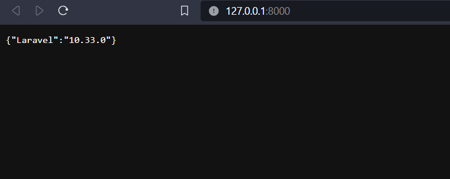

# Nombre del Proyecto

ct-candidates-app

## Requisitos

- PHP >= 8.3
- Composer
- Node.js y npm
- MySQL o cualquier otro sistema de gestión de bases de datos compatible
- Xampp

## Configuración del Entorno

1. **Clonar el Repositorio:**

   ```bash
   git clone https://github.com/pspaulus/ct-candidates-app


2. **Install PHP Dependencies:**

    ```bash
    composer install
    ```

3. **Copy Configuration File:**

    ```bash
    cp .env.example .env
    ```

    Edit the `.env` file with your database configuration and other settings.

4. **Run Migrations and Seed Data:**

    ```bash
    php artisan migrate --seed
    ```

5. **Run Project:**

    ```bash
    php artisan serve
    ```


